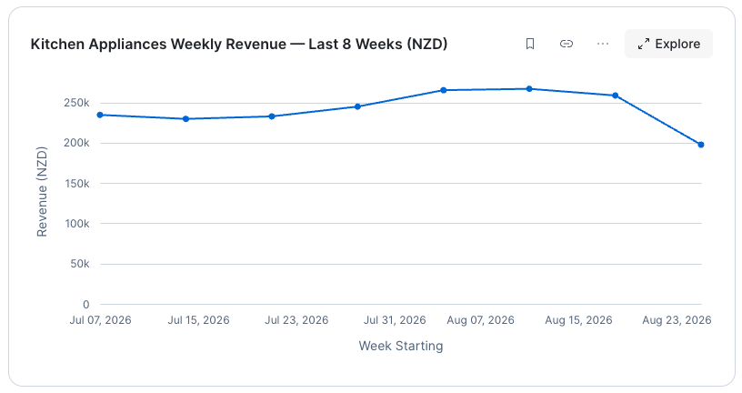

# Act 1: Spot the Problem (~10 min)

> **Business Context:** Jordan's buyer meeting is at 2pm. First instinct: how did my category do last week? In the old world, this means opening a dashboard, checking filters, then filing a ticket for any follow-up. With CoWork, it's a conversation.

Each question in this section introduces a different CoWork capability. Pay attention to the feature callout after each one.

---

## Q0 — Check Your Calendar

It's Monday morning. Before diving into data, Jordan checks what's on for the day.

!!! action "Ask CoWork what's on your calendar"

    ```text
    What's on my calendar today?
    ```

**What to expect:** CoWork surfaces today's meetings, including a **2pm Buyer Meeting**. That meeting is your deadline — everything from here on is prep for it.

---

## Q1 — Natural Language Q&A + Verified Answers

!!! action "Ask CoWork about your category's performance"

    ```text
    How did Home & Kitchen perform last week compared to the week before?
    ```

**What to expect:** A total revenue number for Aug 25-31 (~NZD 880K), compared to the prior week (~NZD 931K) — a decline of roughly 5%. This sets up the investigation: what's behind the drop?

**New feature — Verified Answers:** Look for the green shield icon next to the response. This indicates a metric backed by a curated, data-team-approved definition — not just AI reasoning, but an organisation-agreed calculation.


| Signal | Meaning |
|--------|---------|
| Green shield | Uses a curated, data-team-approved definition |
| No shield | CoWork reasoned from the data schema — accurate, but not pre-validated |

---

## Q2 — Conversational Context (Follow-ups)

!!! action "Ask a follow-up question without repeating context"

    ```text
    Which subcategory drove the decline?
    ```

**What to expect:** A breakdown showing **Kitchen Appliances** as the clear underperformer, accounting for the department's decline.

**New feature — Conversational context:** Notice you didn't re-specify "Home & Kitchen" or "last week." CoWork maintains the thread context — each question builds on the prior answer, just like talking to a colleague.

---

## Q3 — Auto-Visualization (Trend Line Chart)

!!! action "Ask for a trend over time"

    ```text
    Show me Kitchen Appliances revenue by week for the past 8 weeks
    ```

**What to expect:** A line chart showing steady/growing revenue, then a visible drop in recent weeks. The visual "something broke" moment.



**New feature — Auto-visualization:** CoWork generates the chart automatically — you didn't specify "line chart." The agent infers that a time-series question should produce a trend visualization, while comparisons get bar charts.


!!! action "Save the chart as an Artifact"

    Click the **Bookmark** icon on this chart to save it. You'll use it in your meeting brief later.

> **What are Artifacts?** Any chart or table can be saved to your Artifacts panel (left sidebar). They persist, are shareable, and you can revisit them without regenerating.

---

## Q4 — Chart Customization + Cross-Table Reasoning

!!! action "Ask for a specific chart format"

    ```text
    Which products in Kitchen Appliances declined the most? Show as a horizontal bar chart sorted by revenue decline
    ```

**What to expect:** A horizontal bar chart ranking products by decline. You may notice the top decliners share something in common — keep that in mind for the next question.

**New feature — Chart customization:** You specified the chart type ("horizontal bar") and the sort order ("sorted by revenue decline"). CoWork respects your visualization preferences. You can always override the auto-generated format.

**New feature — Cross-table reasoning:** This answer required joining daily_sales with products to get product names and grouping by revenue change. CoWork navigated multiple tables without you needing to know the underlying data schema.

---

## Q5 — Multi-Table Joins + Root Cause

The declining products all come from the same supplier — but you shouldn't have to know that in advance. Let's ask CoWork to connect the dots.

!!! action "Ask CoWork to investigate the supplier"

    ```text
    What supplier are the declining Kitchen Appliances products from, and do they have any delivery delays recorded?
    ```

**What to expect:** CoWork links the declining products to their supplier — **Apex Kitchen Co** — and surfaces a delivery delay that started August 25, with an expected resolution of September 8. Root cause confirmed in one question.

**New feature — Multi-table joins in a single question:** This answer required linking products → suppliers → delivery status. CoWork traversed three tables and returned a synthesized answer. In the old world, this is three separate queries and a manual cross-reference.

## What have we learnt?

>  In five questions you went from 'revenue is down' to 'here's the exact supplier, the exact delay start date, and the expected fix date.' This is what used to take hours of analyst time.