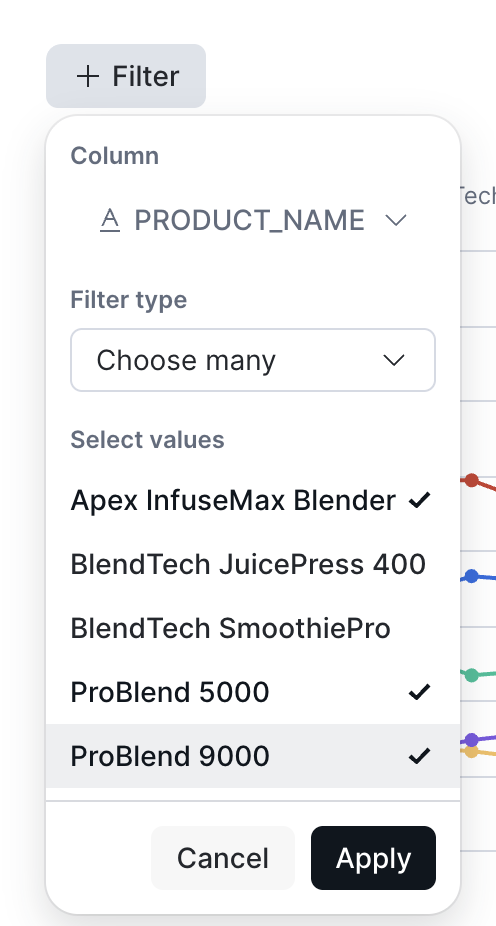

# Act 2: Find the Opportunity (~10 min)

> **Business Context:** Good category managers don't just bring problems to buyer meetings — they bring opportunities. Jordan needs a growth story to pair with the supply disruption. "We're losing money here, but here's where we should invest" is a complete narrative.

---

## Q6 — Discover What's Growing

!!! action "Ask CoWork to find growth opportunities"

    ```text
    Which products in Home & Kitchen have the highest percentage revenue growth over the last 8 weeks?
    ```

**What to expect:** A ranked list of top growers. You may see products from other subcategories (like shelving or decor) growing faster in percentage terms, but look for **ProBlend 9000** in Kitchen Appliances — it's the standout in your category. As a blender, it's compact, easy to stock, and high-margin — exactly the kind of product a category manager can act on quickly for a Q4 buy recommendation.

---

## Q7 — Multi-Series Comparison Chart

ProBlend 9000 is growing — but it's not our only blender. Let's see how it stacks up against the rest of the range.

!!! action "Compare all blender products over time"

    ```text
    How do all the blender products in Kitchen Appliances compare to ProBlend 9000 over time? Show weekly revenue since June as a line chart
    ```

**What to expect:** A multi-series line chart showing all blender models side by side. Look for the key patterns: one product leads on volume, ProBlend 9000 is the clear growth story trending upward, and you may spot a familiar name dropping off in the most recent week.

!!! action "Edit the chart to focus on key products"

    1. Click the **Explore** button on the chart (top right)
    2. Click **+ Filter**
    3. Select **PRODUCT_NAME** from the column list
    4. Tick **Apex InfuseMax Blender**, **ProBlend 5000**, and **ProBlend 9000**
    5. Click **Apply**

    

    6. Click the **->|** icon to the left of the chart title to hide the explore pane. 

This gives you a cleaner visual for your buyer meeting — the three lines that matter: your growth story (ProBlend 9000), the incumbent (ProBlend 5000), and the supplier-impacted product (Apex InfuseMax Blender).

---

## Q8 — Analytical Reasoning

!!! action "Ask an analytical judgment question"

    ```text
    Is ProBlend 9000 cannibalizing ProBlend 5000, or is the total blender category growing?
    ```

**What to expect:** The data tells a clear story: the blender category is **growing**, not cannibalizing. Both ProBlend 5000 and ProBlend 9000 are trending up — the 9000's rise is additive, not stealing share from the 5000. This is genuine category expansion, which strengthens your Q4 buy case.

**New feature — Analytical reasoning:** This isn't a metric lookup — it's a judgment question that requires comparing two trends and drawing a conclusion. CoWork can reason across data, not just retrieve it.

## What have we learnt?
> You now have two stories for your meeting: a fire to address (Apex supplier issue) and an opportunity to propose (increase the ProBlend 9000 buy). All from one conversation with your data in CoWork.
