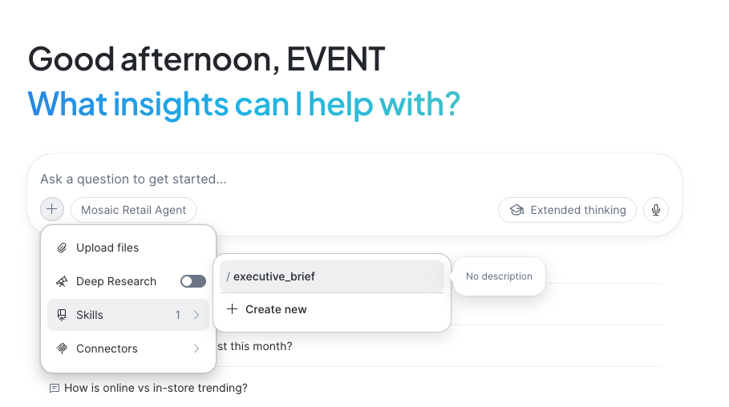

# Bonus Exercises

## Bonus 1 - Create repeatable workflows using Skills.

Often you will want to be able to re-run certain analyses or workflows rather than entering a series of prompts into CoWork. A Skill helps package a repeatable workflow. CoWork can then leverage that skill to perform the workflow or task.

Category Managers need to submit an executive briefing on their product category each week. Imagine if we could have Snowflake CoWork generate that for us? 

!!! action "Create an automation to prepare the executive briefing each Monday"
    1. In the left hand menu click **New Chat**
    2. Then click the **+** button in bottom left hand corner of the chat box 
    2. Hover over the **Skills** option then click **/executive_brief**
    3. You will see **/executive_brief** appear in the chat box. 
    4. Click the **Send** button 



**What to expect:**  The Skill contains a set of instructions that guide CoWork through creating a Category Insights Executive briefing. It will:

1. Gather data about category revenue, channel performance and generate as set of category metrics.
2. Try to identify relevant trends and patterns over the last week.
3. Identify possible risks and issues that might need to be investigated and addressed.
4. Generate a set of recommendations.
5. Produce a concise report suitable for briefing the executive.
 

**New feature — Skills:** Skills allow you to capture a workflow or set of instructions that can get CoWork to run. The skills can be associated with the agent, like the example you just used, or users can build there own skills. 

---

## Bonus 2 - Schedule CoWork to do work via Automations

You may have tasks or workflows that you need to run every day, or once week, or once a month. You can define a prompt then ask CoWork to schedule it for you. These are called automations. Lets create a new automation to automatically prepare your executive briefing each Monday morning.

!!! action "Create an automation to prepare the executive briefing each Monday"

    ```text
    Schedule the Category Executive briefing to run each Monday morning at 9am and email me the output
    ```

**What to expect:**  Snowflake CoWork will set up a new **Automation**. This will run automatically every Monday at 9am , call the **executive brief** skill, and then email you the output. You can see you Automations by clicking **Automations** in the left hand menu in CoWork.


**New feature — Automations:** Get CoWork to take a one off prompt, report, or analysis and turn it into a recurring one.

---

## Bonus 3 - Governance Demo

Throughout this lab you've been working with **Home & Kitchen** data — but Mosaic Retail has other departments too (Electronics, Fashion, Sports & Outdoors). Let's see what happens when you try to access data outside your role.

!!! action "Try to access data outside your department"

    ```text
    Can you show me the sales data for the Electronics department?
    ```

**What to expect:** CoWork will **not** return Electronics data. Your role (HOL_ATTENDEE_ROLE) is restricted to Home & Kitchen only via a row access policy. CoWork inherits the same security controls that your Snowflake admin has already configured — there's no separate security model to manage.

This means the same agent, same data, same question can return different results depending on who's asking. A Commercial Director with full access would see all four departments. You, as a Category Manager for Home & Kitchen, see only your world.

**New feature — Row-Level Security inheritance:** CoWork doesn't have its own security model. It inherits whatever RBAC and row access policies your admin already configured in Snowflake. See [Row Access Policies documentation](https://docs.snowflake.com/en/user-guide/security-row-intro).
