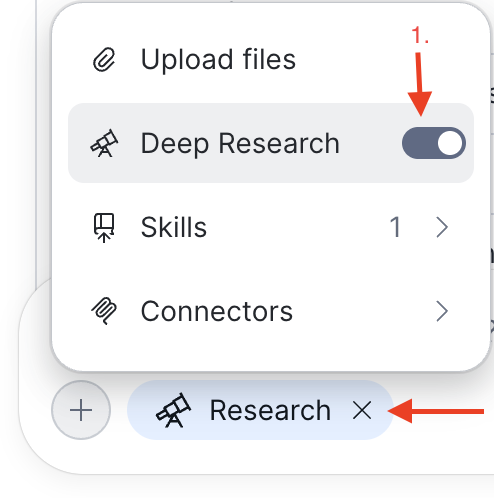
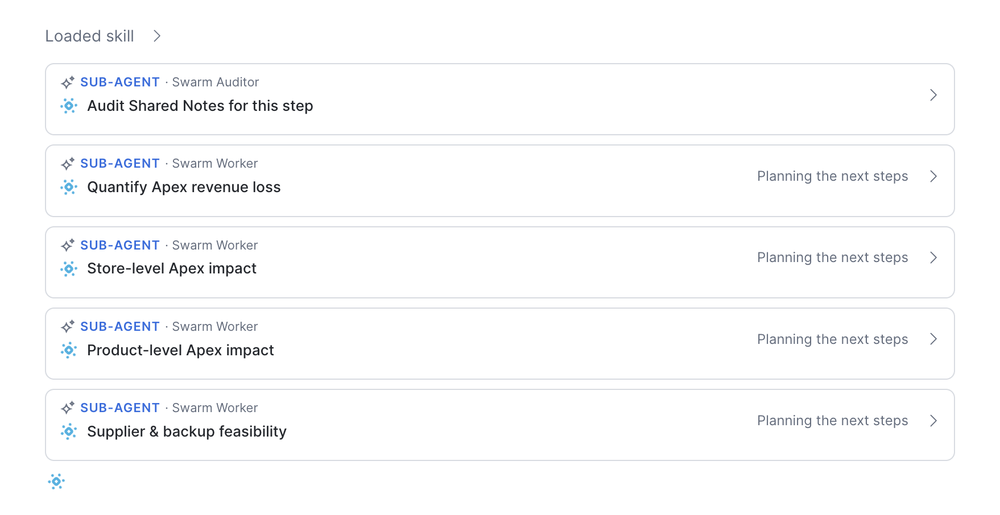
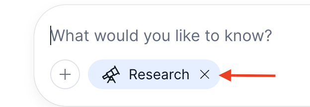
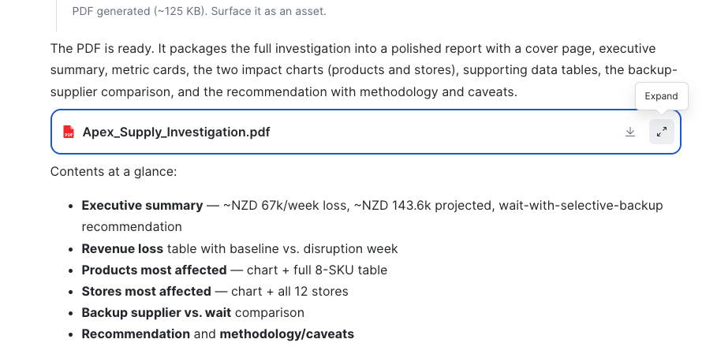

# Deep Research (~10 min)

> **Business Context:** Jordan has the "what" — now they need a formal recommendation at a depth suitable for a buyer meeting. Deep Research produces multi-page cited reports in minutes, not days.

## When to Use Deep Research vs Standard Chat

| Use Deep Research when... | Use standard chat when... |
|--------------------------|--------------------------|
| You need to understand *why* | You need a quick *what* |
| The answer spans multiple data domains | The answer comes from one table/metric |
| You want a shareable report with citations | You want a quick number or chart |
| You'd normally ask an analyst for this | You'd normally check a dashboard |

See [Deep Research documentation](https://docs.snowflake.com/en/user-guide/snowflake-cowork/using-cowork#deep-research).

---

## Q9 — Deep Research (Multi-Agent Investigation)

!!! action "Enable Deep Research and investigate the supply disruption"

    1. Click the **+ button** in the Chat box
    2. Toggle the **Deep Research** switch to the **on** position
    
    3. Enter the following prompt:

    ```text
    Investigate the Apex Kitchen Co supply disruption's impact on Kitchen Appliances. Quantify the total revenue loss, identify which products and stores were most affected, and recommend whether we should activate a backup supplier or wait for resolution on September 8.
    ```

**What to expect:** Deep Research decomposes your question into 3-5 sub-investigations and runs them in parallel. This takes 3-5 minutes.



The final report includes:
- Total revenue loss quantified
- Products ranked by impact
- Stores most affected
- A "wait vs. diversify" recommendation backed by data
- Revenue-at-risk calculation if Sep 8 slips

**New feature — Deep Research:** Unlike standard chat (single query → single answer), Deep Research runs a multi-agent investigation: it decomposes the question, executes parallel sub-queries, synthesizes findings, and produces a cited report. Every claim has a reference you can click to see the underlying query.

## Q10 - Create a PDF of the research output

!!! action "Turn off Deep Research and generate a PDF"

    1. Click the **X** button on the **Research** pill in the chat box to turn off Deep Research
    
    2. Enter the following prompt:

    ```text
    Create a PDF of the Apex Kitchen Co supply investigation output
    ```

**What to expect:** CoWork will produce a downloadable PDF of the deep research output. Once the PDF has been generated you can click the **expand** icon to preview the PDF in CoWork or click the **Download** icon to download the report.




**New feature — Built-in skills and code execution environment:** Snowflake CoWork is bundled with skills that allow it to perform certain tasks such as generating a PDF. If needed, CoWork can also access a secure sandbox to create and execute code.

---


## What have we learnt?
> You used CoWork's Deep Research mode to perform a detailed analysis of the Apex Kitchen Co supply disruption. We have a clearer view of the revenue and channel impact of the disruption along with a recommended path forward. This was all done in minutes, not hours or days.