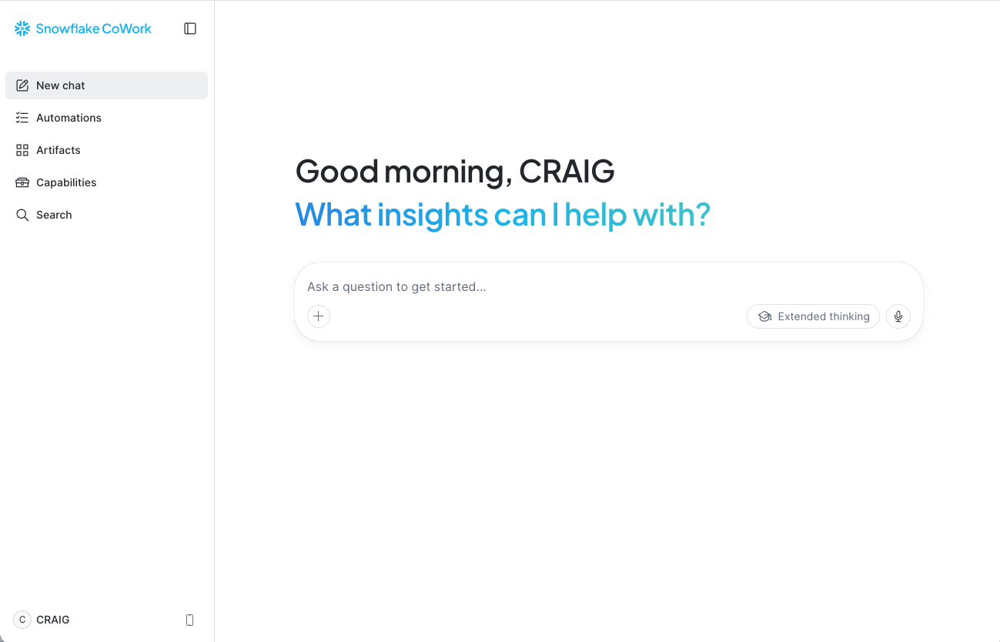
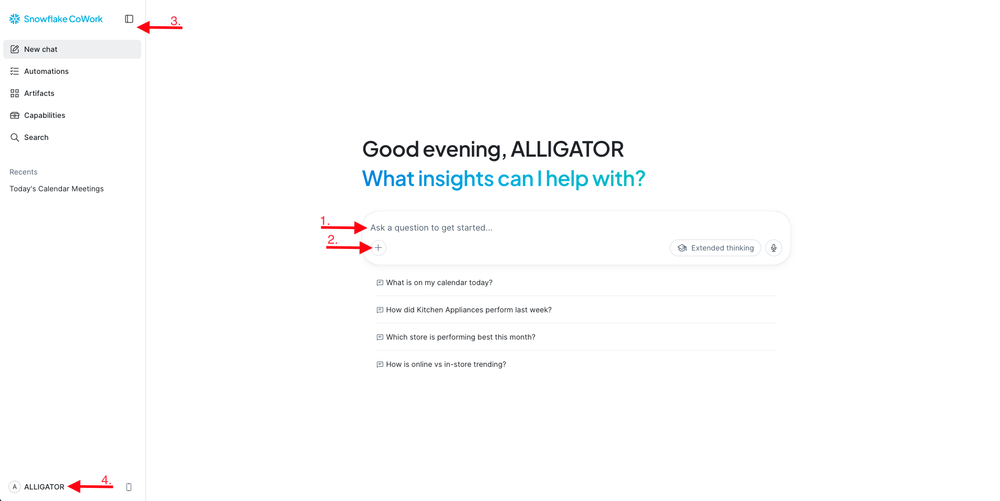

# Getting Started (~5 min)

> **Business Context:** In the traditional workflow, before Jordan can even ask a question, they need to log in to a BI tool, find the right dashboard, check if data is refreshed, and hope it answers their specific question. With CoWork, setup is: open browser, ask question.

!!! note "Your outputs may look different — that's expected"

    CoWork is powered by an AI agent, which means responses are **non-deterministic**. The exact wording, chart formatting, and level of detail you see may differ from your neighbour's or from the examples in this guide. That's normal — you are all querying the same data, so the **underlying numbers and story will be the same**, even if the presentation varies. If your answer doesn't look exactly like the screenshot, don't worry — focus on the data insights, not the formatting.

## Step 1: Log In

!!! action "Sign in to Snowflake CoWork"

    1. Copy the following **Account Identifier** to your clipboard:

        ```text
        sfsehol-snowflake_world_tour_auckland_ueylku
        ```

    2. Click this link to open Snowflake CoWork: [Snowflake CoWork](https://ai.snowflake.com)
    3. Click the **Sign In** button then paste the account identifier into the field labelled **Enter your account identifier or account URL**.
    4. Click the **Sign In** button
    5. When prompted, enter the **Username** and **Password** provided by your lab instructor

You should see the CoWork chat interface — a clean conversational window ready for your questions.



## Step 2: Orient Yourself

Take a minute to orient yourself with the Snowflake CoWork landing page.



| # | Element | What It Does |
|---|---------|-------------|
| 1 | **Chat input box** | Where you type natural-language questions |
| 2 | **+ button** | Access Deep Research, file uploads, skills, and connectors |
| 3 | **Navigation menu** (left panel) | Create new chat session, access chat history, access saved artifacts and more |
| 4 | **Your profile** (bottom left) | Access your user settings |

